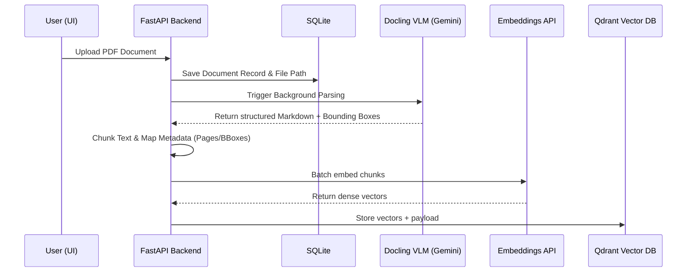
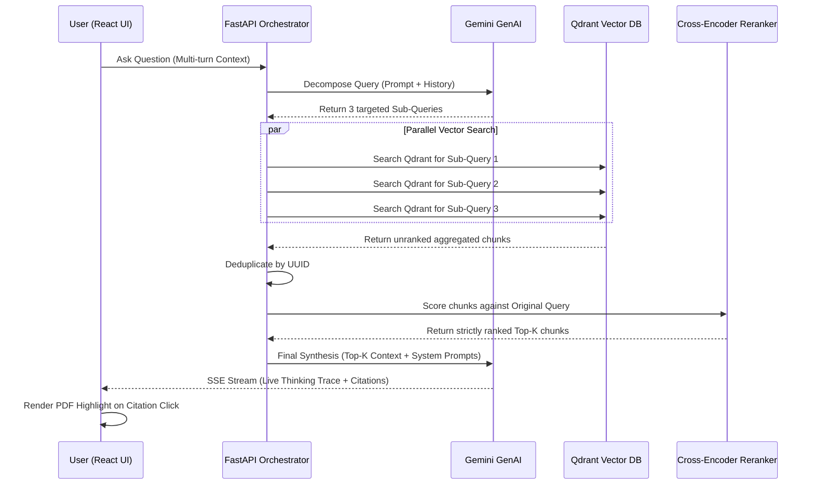

# Agentic PDF RAG: Financial Earnings Intelligence

A conversational agent designed to ingest dense, unstructured financial PDF documents and provide strictly grounded, transparent, and multi-turn analytical intelligence.

## What We Did (Features)

This application satisfies all core objectives of the assessment and expands into the "Excellent" territory through Agentic reasoning and layout-aware chunking.

1. **Ingestion & Indexing (Docling VLM Pipeline)**:
   - We utilized **Docling** powered by Gemini 3.1 Flash-Lite as a Visual Language Model (VLM) parser. It parses complex multi-column earnings decks into clean structured Markdown while retaining exact page numbers and PDF bounding box elements.
   - Chunks are vectorized using Google's GenAI Embeddings and indexed inside a local **Qdrant** database, while metadata is mapped directly into a relational SQLite database.

2. **Conversational Multi-Turn RAG**:
   - Integrated a Next.js chat interface that binds to a FastAPI asynchronous streaming backend.
   - Conversation history is automatically accumulated by the frontend and passed into the LLM chain to establish seamless follow-up capabilities.

3. **Grounded Answers with Strict Citations**:
   - The final AI generation is heavily prompted to refuse hallucinations (e.g., answering "Not found in the document") and is enforced to attach visually consistent metadata citations `[cX pXX]` mapped back to the origin chunk ID and page number.
   - **Bonus Feature**: Clicking a citation button in the UI directly interfaces with `@react-pdf-viewer`'s highlight plugin to geographically navigate to and draw a bounding-box over the exact paragraph in the UI.

4. **Deep Research Trace (Retrieval Visibility)**:
   - Built a real-time terminal tracing block inside the chat UI (Powered by Server-Sent Events). The moment a user submits a query, the backend live-streams its multi-agent orchestration steps (Query complexity, Sub-queries generated, Qdrant cluster pools, and Reranking operations). 

---

## Why We Did It That Way (Design Decisions)

- **Why a Multi-Agent Retrieval Architecture?**
  Financial questions (*"What are the major business segments?"*) typically require aggregating facts scattered across pages 4, 10, and 20. Standard single-shot Dense Vector Retrieval frequently misses the 'forest for the trees'. We implemented a **Decomposition Agent** that spawns parallel queries to dramatically boost retrieval recall density across the document before passing it to the final orchestrator. I have mentioned about it more in my blog [here](https://devlit.ai/blog/machine-epistemology)
  
- **Why Cross-Encoder Reranking?**
  Because our parallel decomposition retrieves a massively wide pool of potential document passages (sometimes 30+ chunks), we decoupled the vector space entirely. We pool the chunks, deduplicate them, and feed them through the `ms-marco-MiniLM-L-6-v2` neural Cross-Encoder. This ensures that the final Top-8 chunks squeezed into the LLM context window are mathematically verified against the true user intent.

- **Why VLM parsing over PyPDF/OCR?**
  Earnings decks contain heavily stylized tables and layout hierarchies. Traditional splitters butcher tabular data. By using a VLM approach, we process images of the pages organically, ensuring maximum fidelity of numeric and segmented financial structures.

- **Why Server Sent Events (SSE) over WebSockets?**
  SSE provides a flawless unidirectional data stream that inherently buffers against network chunking without the heavyweight handshake protocols of WebSockets, seamlessly bridging Python's asynchronous async-generators with React's functional state arrays.

---

## How We Are Doing It (Architecture)

### 1. Ingestion Pipeline



### 2. Deep Agent Retrieval Pipeline


---

## Setup & Execution

1. **Environment Configuration**:
   Create a secure `.env` file mapped to the repository root. You can do this by copying the included sample file:
   ```bash
   cp sample.env .env
   ```
   *Edit `.env` and insert your active `GEMINI_API_KEY`.*

2. **Boot the Platform**:
   Execute the container orchestration sequence to build the Next.js frontend, install Python dependencies, run Uvicorn, and securely sandbox Qdrant.
   ```bash
   docker compose --env-file .env up --build
   ```

3. **Access the Interface**:
   Visit [http://localhost:3000](http://localhost:3000) in your browser. Upload the sample `AEL_Earnings_Presentation.pdf`, select the workspace, and begin exploring.

---

## Future Extensions (Given More Time)

This project was developed within ~4hrs, so there are many things that could be improved.

1. **Hybrid Retrieval (BM25 + Semantic)**:
   While our semantic search is powerful, precise numeric lookups (e.g., exact revenue string "14,236") can occasionally slip past dense vectors. Fusing Qdrant's BM25 payload indices with our vector indices via Reciprocal Rank Fusion (RRF) would maximize exact-match tracking.
2. **Dynamic Confidence Fallbacks (Refusals)**:
   We can calculate the absolute standard deviation of the cross-encoder hit scores. If the topmost retrieved chunk falls beneath a critical relevance threshold, we can short-circuit the LLM synthesis entirely and instantly render *"Not found in the document"* to save latency and guarantee absolute zero-hallucination.
3. **Persistent SQL Conversation Saves**:
   Migrate the in-memory React session data mapping back to the SQLite layer to allow users to revisit past analytical chat histories globally.
4. **Agentic Tabular Execution**:
   Provide the system an isolated Python sandbox. If the LLM detects heavy numeric density, auto-generate standard python pandas scripts to calculate YoY growth trajectories rather than relying on textual LLM math limits.